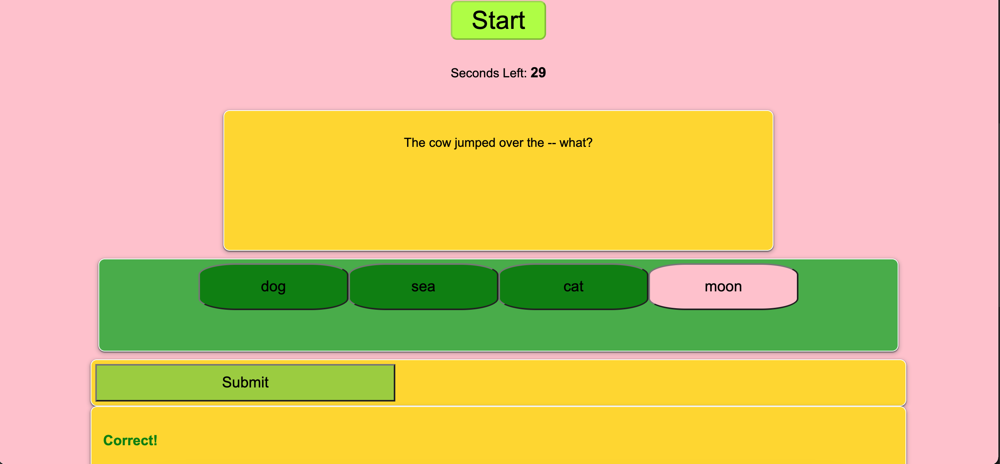

## Timed Quiz

This project was designed to create a timed quiz.  Upon loading this application, the user is presented with an option to view high scores or start the quiz.  Once the user starts the quiz they are presented with a series of questions, one by one, that require an answer in order for the quiz to continue.  If the answer to the question is right, the user has a point added to their score counter and recieves a "Correct!" response, if wrong the user has 5 seconds subtracted from their quiz timer and receives a "Wrong!" response. Upon completion of the quiz the user is presented their score and have an option to locally store their initials and score on the High Score List.

## Built With

* [HTML](https://developer.mozilla.org/en-US/docs/Web/HTML)
* [CSS](https://developer.mozilla.org/en-US/docs/Web/CSS)
* [Javascript](https://developer.mozilla.org/en-US/docs/Web/JavaScript)

## Deployed Link

## Authors

* **Matthew Weichel** 

- [Link to Github](https://github.com/maweiche)

See also the list of [contributors](https://github.com/your/project/contributors) who participated in this project.

## License

This project is licensed under the MIT License 

## Acknowledgments

* Hat tip to anyone whose code, libraries, packages, or UI was used  / inspired from

